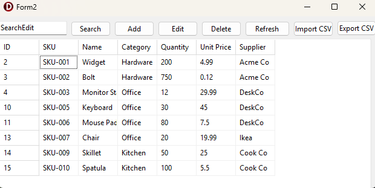
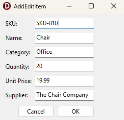

# Delphi Inventory Integration Dashboard

A full-stack retail inventory management tool built to practice integrating a
Windows desktop client with a REST API and SQL-backend.

Delphi VCL frontend 
        | HTTP (JSON)
        v
Node.js / Express REST API
        | SQL
        v
SQLite database

## Running the application

Requires Node.js 18+.

Copy In Terminal:
>> cd api
>> npm install
>> npm start

Then download and run the Inventory Integration App.exe file.

## Features

- View all inventory items in a grid
- Search by name/SKU and filter by category
- Add, edit, and delete inventory items
- Import inventory from a CSV file (upsert on matching SKU)
- Export inventory to a CSV file
- Server-side data validation (required fields, non-negative quantity/price)
- Request logging and centralized error handling on the API
- Client-side error handling for unreachable server

### Endpoints
 
| Method | Path                        | Description                           
|--------|-----------------------------|---------------------------------------
| GET    | `/api/health`               | Health check                          
| GET    | `/api/inventory`            | List items (supports `?search=` and `?category=`) 
| GET    | `/api/inventory/:id`        | Get a single item                     
| POST   | `/api/inventory`            | Create an item                        
| PUT    | `/api/inventory/:id`        | Update an item (partial updates supported) 
| DELETE | `/api/inventory/:id`        | Delete an item                        
| GET    | `/api/inventory/export`     | Download all inventory as CSV          
| POST   | `/api/inventory/import`     | Upload a CSV to bulk create/update 

## Sample data

`sample-data/import_sample.csv` is provided to test the import feature. Its
required columns are `sku`, `name`, `quantity`, `unit_price`; `category` and
`supplier` are optional. Importing a SKU that already exists updates that
row instead of creating a duplicate.
